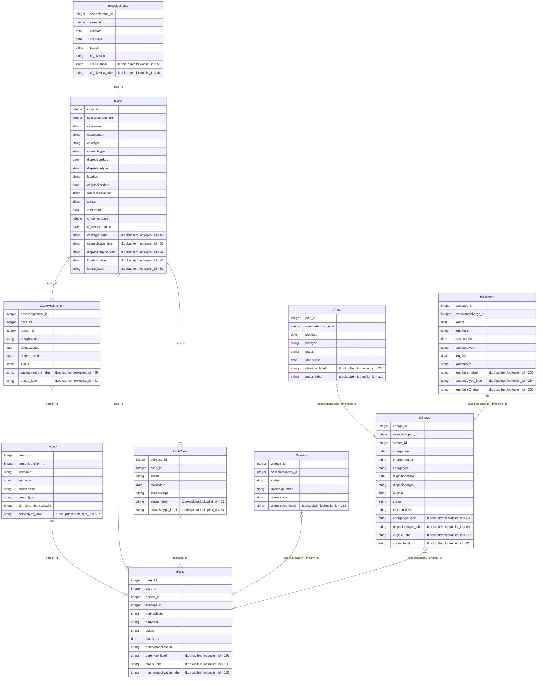

# eDefender Database

## Entity-Relationship Diagram

```mermaid

%%{init: {
  "theme": "default",
  "themeCSS": [
    ".er.relationshipLabel { fill: black; }", 
    ".er.relationshipLabelBox { fill: white; }", 
    ".er.entityBox { fill: lightgray; }",
    "[id^=entity-tSpecialStatus] .er.entityBox { fill: #F9F871;} ",
    "[id^=entity-tCase] .er.entityBox { fill: #FF9671;} ",
    "[id^=entity-tPerson] .er.entityBox { fill: #FFD15F;} ",
    "[id^=entity-tCharge] .er.entityBox { fill: #D3D4BE;} ",
    "[id^=entity-tParty] .er.entityBox { fill: #00C9A7;} ",
    "[id^=entity-tSubCase] .er.entityBox { fill: #4ABAFF;} ",
    "[id^=entity-tPlea] .er.entityBox { fill: #f8f1e1;} ",
    "[id^=entity-tWarrant] .er.entityBox { fill: #C7FCEC;} ",
    "[id^=entity-tSentence] .er.entityBox { fill: #f8f1e1;} ",
    "[id] .er.entityLabel { font-weight: bold; } "
    ]
    
}}%%
erDiagram
    tSpecialStatus ||--|| tCase: "case_id"
    tCase ||--|{ tCaseAssignment: "case_id"
    tCaseAssignment }|--|| tPerson: "person_id"        
    tCase ||--|{ tSubCase: "case_id"
    tPerson ||--|{ tParty: "person_id"
    tCase }|--|{ tParty: "case_id"
    tSubCase }|--|{ tParty: "subcase_id"
    tWarrant }o--|| tParty: "associatedparty_id=party_id"
    tCharge }|--|| tParty: "associatedparty_id=party_id"
    tPlea |o--|| tCharge: "associatedcharge_id=charge_id"
    tSentence ||--|| tCharge: "associatedcharge_id=charge_id"

    tCase { 
        integer case_id ""
        integer sourcecasenumber ""
        string casename ""
        string casenumber ""
        string casetype ""
        string casesubtype ""
        date dispositiondate ""
        string dispositiontype ""
        string location ""
        date originalfileddate ""
        string referencenumber ""
        string status ""
        date statusdate ""
        integer cf_convertcase ""
        date cf_nexteventdate ""
        string casetype_label "tLookupItem.lookuplist_id = 56"
        string casesubtype_label "tLookupItem.lookuplist_id = 53"
        string dispositiontype_label "tLookupItem.lookuplist_id = 44"
        string location_label "tLookupItem.lookuplist_id = 46"
        string status_label "tLookupItem.lookuplist_id = 52"
    }
    tSubCase { 
        integer subcase_id ""
        integer case_id ""
        string status ""
        date statusdate ""
        string subcasetype ""
        string status_label "tLookupItem.lookuplist_id = 52"
        string subcasetype_label "tLookupItem.lookuplist_id = 54"
    }
    tCaseAssignment	{ 
        integer caseassignment_id ""
        integer case_id ""
        integer person_id ""
        string assignmentrole ""
        date dateassigned ""
        date dateremoved ""
        string status ""
        string assignmentrole_label "tLookupItem.lookuplist_id = 39"
        string status_label "tLookupItem.lookuplist_id = 41"
    }
    tSpecialStatus { 
        integer specialstatus_id ""
        integer case_id ""
        date enddate ""
        date startdate ""
        string status ""
        string cf_division ""
        string status_label "tLookupItem.lookuplist_id = 51"
        string cf_division_label "tLookupItem.lookuplist_id = 46"
    }
    tPerson	{ 
        integer person_id ""
        integer personidentifier_id ""
        string firstname ""
        string lastname ""
        string middlename ""
        string persontype ""
        integer cf_noirnumberavailable ""
        string persontype_label "tLookupItem.lookuplist_id = 537"
    }
    tParty { 
        integer party_id ""
        integer case_id ""
        integer person_id ""
        integer subcase_id ""
        string partysubtype ""
        string partytype ""
        string status ""
        date statusdate ""
        string nonmonapplication ""
        string partytype_label "tLookupItem.lookuplist_id = 197"
        string status_label "tLookupItem.lookuplist_id = 196"
        string nonmonapplication_label "tLookupItem.lookuplist_id = 181"
    }
    tWarrant { 
        integer warrant_id ""
        integer associatedparty_id ""
        string status ""
        string trackingnumber ""
        string warranttype ""
        string warranttype_label "tLookupItem.lookuplist_id = 286"
    }
    tCharge { 
        integer charge_id ""
        integer associatedparty_id ""
        integer statute_id ""
        date chargedate ""
        string chargenumber ""
        string chargetype ""
        date dispositiondate ""
        string dispositiontype ""
        string eligible ""
        string status ""
        string ticketnumber ""
        string chargetype_label "tLookupItem.lookuplist_id = 63"
        string dispositiontype_label "tLookupItem.lookuplist_id = 60"
        string eligible_label "tLookupItem.lookuplist_id = 117"
        string status_label "tLookupItem.lookuplist_id = 62"
    }
    tPlea {
        integer plea_id ""
        integer associatedcharge_id ""
        date pleadate ""
        string pleatype ""
        string status ""
        date statusdate ""
        string pleatype_label "tLookupItem.lookuplist_id = 220"
        string status_label "tLookupItem.lookuplist_id = 219"
    }
    tSentence { 
        integer sentence_id ""
        integer associatedcharge_id ""
        float length ""
        string lengthunit ""
        date sentencedate ""
        string sentencetype ""
        float length2 ""
        string lengthunit2 ""
        string lengthunit_label "tLookupItem.lookuplist_id = 255"
        string sentencetype_label "tLookupItem.lookuplist_id = 254"
        string lengthunit2_label "tLookupItem.lookuplist_id = 255"
    }
```
