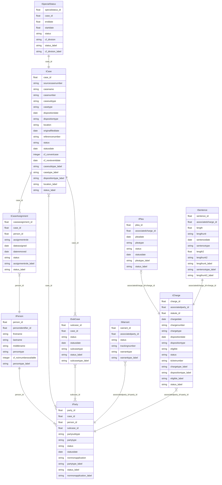

```mermaid

%%{init: {
  "theme": "default",
  "themeCSS": [
    ".er.relationshipLabel { fill: black; }", 
    ".er.relationshipLabelBox { fill: white; }", 
    ".er.entityBox { fill: lightgray; }",
    "[id^=entity-tSpecialStatus] .er.entityBox { fill: #F9F871;} ",
    "[id^=entity-tCase] .er.entityBox { fill: #FF9671;} ",
    "[id^=entity-tPerson] .er.entityBox { fill: #FFD15F;} ",
    "[id^=entity-tCharge] .er.entityBox { fill: #D3D4BE;} ",
    "[id^=entity-tParty] .er.entityBox { fill: #00C9A7;} ",
    "[id^=entity-tSubCase] .er.entityBox { fill: #4ABAFF;} ",
    "[id^=entity-tPlea] .er.entityBox { fill: #f8f1e1;} ",
    "[id^=entity-tWarrant] .er.entityBox { fill: #C7FCEC;} ",
    "[id^=entity-tSentence] .er.entityBox { fill: #f8f1e1;} "
    ]
    
}}%%
erDiagram
    tSpecialStatus ||--|| tCase: "case_id"
    tCase ||--|{ tCaseAssignment: "case_id"
    tCaseAssignment }|--|| tPerson: "person_id"        
    tCase ||--|{ tSubCase: "case_id"
    tPerson ||--|{ tParty: "person_id"
    tCase }|--|{ tParty: "case_id"
    tSubCase }|--|{ tParty: "subcase_id"
    tWarrant }o--|| tParty: "associatedparty_id=party_id"
    tCharge }|--|| tParty: "associatedparty_id=party_id"
    tPlea |o--|| tCharge: "associatedcharge_id=charge_id"
    tSentence ||--|| tCharge: "associatedcharge_id=charge_id"

    tCase { 
        float case_id ""
        string sourcecasenumber ""
        string casename ""
        string casenumber ""
        string casesubtype ""
        string casetype ""
        date dispositiondate ""
        string dispositiontype ""
        string location ""
        date originalfileddate ""
        string referencenumber ""
        string status ""
        date statusdate ""
        integer cf_convertcase ""
        date cf_nexteventdate ""
        string casesubtype_label ""
        string casetype_label ""
        string dispositiontype_label ""
        string location_label ""
        string status_label ""
    }
    tSubCase { 
        float subcase_id ""
        float case_id ""
        string status ""
        date statusdate ""
        string subcasetype ""
        string status_label ""
        string subcasetype_label ""
    }
    tCaseAssignment	{ 
        float caseassignment_id ""
        float case_id ""
        float person_id ""
        string assignmentrole ""
        date dateassigned ""
        date dateremoved ""
        string status ""
        string assignmentrole_label ""
        string status_label ""
    }
    tSpecialStatus { 
        float specialstatus_id ""
        float case_id ""
        float enddate ""
        float startdate ""
        string status ""
        string cf_division ""
        string status_label ""
        string cf_division_label ""
    }
    tPerson	{ 
        float person_id ""
        float personidentifier_id ""
        string firstname ""
        string lastname ""
        string middlename ""
        string persontype ""
        integer cf_noirnumberavailable ""
        string persontype_label ""
    }
    tParty { 
        float party_id ""
        float case_id ""
        float person_id ""
        float subcase_id ""
        string partysubtype ""
        string partytype ""
        string status ""
        date statusdate ""
        string nonmonapplication ""
        string partytype_label ""
        string status_label ""
        string nonmonapplication_label ""
    }
    tWarrant { 
        float warrant_id ""
        float associatedparty_id ""
        string status ""
        string trackingnumber ""
        string warranttype ""
        string warranttype_label ""
    }
    tCharge { 
        float charge_id ""
        float associatedparty_id ""
        float statute_id ""
        date chargedate ""
        string chargenumber ""
        string chargetype ""
        date dispositiondate ""
        string dispositiontype ""
        string eligible ""
        string status ""
        string ticketnumber ""
        string chargetype_label ""
        string dispositiontype_label ""
        string eligible_label ""
        string status_label ""
    }
    tPlea {
        float plea_id ""
        float associatedcharge_id ""
        date pleadate ""
        string pleatype ""
        string status ""
        date statusdate ""
        string pleatype_label ""
        string status_label ""
    }
    tSentence { 
        float sentence_id ""
        float associatedcharge_id ""
        float length ""
        string lengthunit ""
        date sentencedate ""
        string sentencetype ""
        float length2 ""
        string lengthunit2 ""
        string lengthunit_label ""
        string sentencetype_label ""
        string lengthunit2_label ""
    }
```
